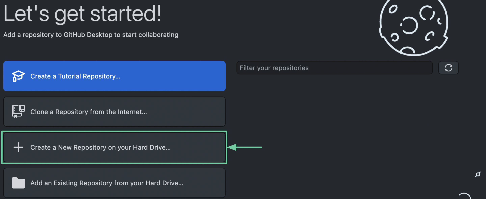

# Инструкция по работе с GitHub и GitHub Desktop

*Текущая инструкция предназначена для осуществления первичного знакомства с функциональными возможностями сервиса для хранения и версионирования данных GitHub. В целях раскрытия базовой функциональности сервиса, данная инструкция содержит упрощения, допустимые на начальных этапах обучения или в случае отсутсвия необходимости детального изучения принципов работы системы версионирования Git.*

## Навигация:
* [Для чего нужен GitHub](#about)
* [Основные термины](#basicTerms)
* [Регистрация и установка GitHub](#registration)
* [Создание и клонирование репозитория](#createRep)
* [Редактирование файлов](#edit)
* [Работа с разметкой](#markdown)
  
##  Для чего нужен GitHub

Нередко в процессе работы перед программистом встает необходимость **публикации своего проекта в общедоступных ресурсах или же синхронизация проделанной работы** с остальными участниками процесса. 

> **Q:** Почему бы просто не сохранять файлы в каком-либо облачном хранилище?  
> **A:** Действительно! Ответ найден, дальнейшие рассуждения бессмысленны *(нет)*.

  
Однако в реальности все не так просто. Мы можем воспользоваться облачным хранилищем в случае, если нам необходимо сохранить свой проект до лучших времен, **но развернуть сайт или даже произвести элементарные изменения в коде, непосредственно в облаке, у нас скорее всего не получится**. 

Cущественно осложняет процесс сохранения проекта и возможная необходимость синхронизации вносимых изменений нами и нашими коллегами. Представьте что вы работаете в команде, где над одним файлом в разное время может трудиться несколько человек. В таком случае внесение любых изменений может осуществляться посредством загрузки актуальной версии файла с перезаписью предыдущей. *Но что если изменения вносятся параллельно?* Вероятно придется составлять файл вручную, учитывая все возможные версии файла. *А как быть в ситуации если сотрудники живут в разных часовых поясах? Как хранить историю изменений, авторов, даты внесения правок?*

Все эти вопросы и сложности должны натолкнуть нас на мысль о написании некоторой программы для автоматизации всех процессов связанных с храненим данных, но к счатью уже существуют и доступны для общего пользования. Подобные программы принято называть распределенными системами хранения версий *(git)*, а одной из крупнейших таких систем является **GitHub**.

##  Основные термины
Перед началом работы с GitHub рекомендуем вам ознакомиться с базовыми понятиями:
* **Git или Гит** — система контроля и управления версиями файлов.

* **GitHub или Гитхаб** — веб-сервис для размещения репозиториев и совместной разработки проектов.

* **Репозиторий** — каталог файловой системы, в котором находятся: файлы конфигурации, файлы журналов операций, выполняемых над репозиторием, индекс расположения файлов и хранилище, содержащее сами контролируемые файлы.

* **Ветка (Branch)** — это параллельная версия репозитория. Она включена в этот репозиторий, но не влияет на главную версию, тем самым позволяя свободно работать в параллельной. Когда вы внесли нужные изменения, то вы можете объединить их с главной версией.

* **Форк (Fork)** — копия репозитория. Его также можно рассматривать как внешнюю ветку для текущего репозитория. Копия вашего открытого репозитория на Гитхабе может быть сделана любым пользователем, после чего он может прислать изменения в ваш репозиторий через пулреквест.

*  <a name="clone"> **Клонирование (Clone)** — скачивание репозитория с удалённого сервера на локальный компьютер в определённый каталог для дальнейшей работы с этим каталогом как с репозиторием.

##  Регистрация и установка GitHub
Чтобы начать работу с сервисом GitHub, вам необходимо завести учетную запись.  
Для регистрации аккаунта перейдите на [официальный сайт GitHub](https://github.com/) и нажмите на кнопку **"Sign Up"** (зарегистрироваться).

В процессе регистрации **вам будет предложено ввести обязательные данные**:
* адрес электронной почты
* пароль
* имя пользователя

После регистрации на указанную вами почту придет письмо с просьбой подтверждения регистрации. Для завершения регистрации пройдите по ссылке, указанной в письме.

 Скачайте на ваш компьютер GitHub Desktop. Для этого перейдите на [сайт](https://desktop.github.com/) и **скачайте приложение для своей операционной системы**.

Установите и запустите программу. При первом запуске вам необходимо будет **указать логин и пароль от [Гитхаба](https://github.com/)**. *Обратите внимание, что адрес электронной почты должен соответствовать почте пользователя на GitHub.*

##  Создание и клонирование репозитория

Если вы впервые используете GitHub, вам потребуется создать [репозиторий](#repo) (процесс копирования существующего репозитория будет [рассмотрен позже](#cloneRep)). Для создания репозитория на главном экране приложения [GitHub Desktop](#deskApp) выберите пункт **"Create a New Repository on your hard drive"**.

Для создания репозитория вам необходимо ввести его название, описание и выбрать папку на вашем компьютере, куда будут сохраняться файлы. Нажмите на кнопку **"Create repository"** и дождитесь завершения процесса создания репозитория. В итоге на вашем компьютере появится папка, которую можно использовать для разработки проекта.

О том как перенести данные локального репозитория на сервер, для того чтобы все файлы отображались в браузерной версии GitHub и были доступны для просмотра и скачивания другими пользователями, мы расскажем в блоке ["Редактирование файлов"](#edit).

 В случае, если у вас уже есть репозиторий на GitHub, его можно [клонировать](#clone). На главном экране приложения выберите пункт **"Clone a Repository from the Internet"**.

В открывшемся окне выберите один из ваших репозиториев, установите путь для клонирования репозитория и нажмите на кнопку **"Clone"**. 

После этого файлы репозитория начнут скачиваться на ваш компьютер. *Это может занять некоторое время, о чем вам просигнализирует полоса загрузки*.
  
##  Редактирование файлов
В результате [создания](#createRep) или [копирования](#cloneRep) репозитория в рабочей области GitHub Desktop вы сможете увидеть **элементы для управления вашим репозиторием**.

Вероятно вы уже добавили в папку с репозиторием файлы вашего рабочего проекта, внесли все необходимые изменения, а также [составили текстовое описание и настроили навигацию внутри репозитория](#markdown). В этом случае настало время для публикации или обновления репозитория на сервере.

После добавления или изменения файла, **в рабочей области приложения вы увидите все внесенные изменения**. Так, например, в списке измененных файлов вы сможете увидеть все добавленные, удаленные и измененные файлы, а в рабочей области изменения отдельно выбранного файла. *Зеленым отображаются добавленные или измененные строки, а красным те, что не вошли в итоговую версию файла и были удалены или перезаписаны.*

  
Настало время опубликовать наш репозиторий. Если вы клонировали репозиторий, то 

##  Работа с разметкой
